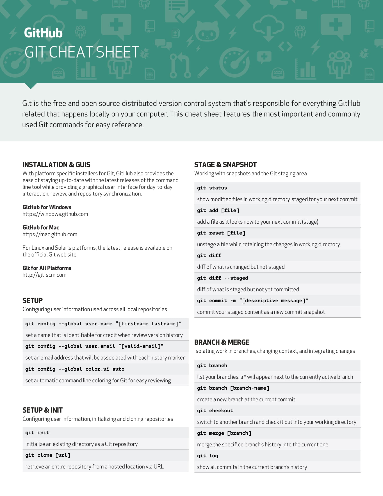
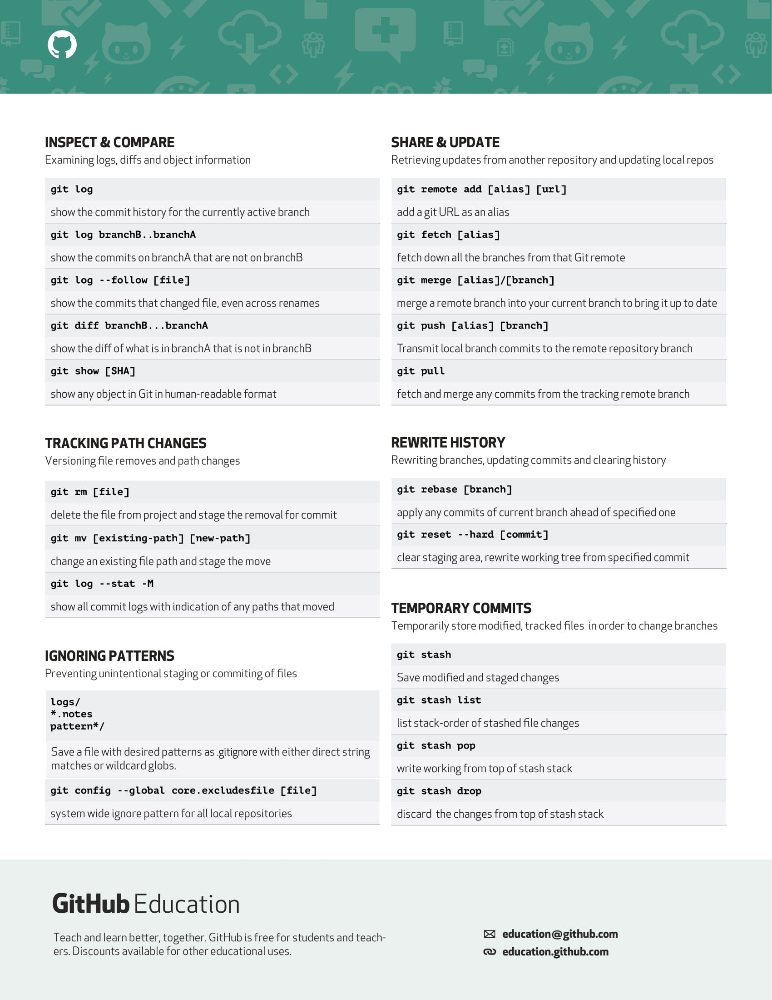

# Alias Kickstarter

This the repo for the ALiAS Lucknow Kickstarter workshop.

Your task is to clone this repository, add your details to the webpage (index.html) and push the changes to the repo. In order to complete this task, you must-:

- Fork this repository to your account
- Clone the repository
- Switch to the dev branch
- Create a new branch named "YourName-dev"
- Add your details to index.html
- Add the changes to the staging area
- Commit the changes
- Push the changes to your fork
- Make a pull request to merge your changes into the dev branch on the main repository

# Git Cheatsheet-:

